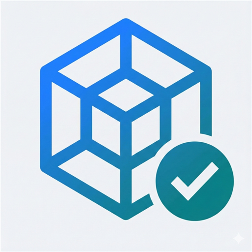

# 🚀 API Workspace

<div align="center">



**The Ultimate Developer Toolkit for REST API Development**

*A comprehensive desktop application that streamlines API testing, data transformation, and security operations*

[](https://github.com/avrhamo/api-workspace)
[](https://github.com/avrhamo/api-workspace/releases)
[](LICENSE)
[](https://github.com/avrhamo/api-workspace)

[Download](https://github.com/avrhamo/api-workspace/releases) • [Documentation](https://github.com/avrhamo/api-workspace/wiki) • [Issues](https://github.com/avrhamo/api-workspace/issues) • [Support](https://buymeacoffee.com/00simpleApps00)

</div>

---

## 🌟 What is API Workspace?

API Workspace is a powerful, **100% offline desktop application** designed specifically for developers who need reliable tools for API testing, data transformation, security operations, and more. Built with modern web technologies and packaged as a cross-platform Electron app, it provides everything you need for professional API development workflows.

### 🎯 Perfect For:
- **API Developers & Testers** - Comprehensive REST API testing with MongoDB integration
- **DevOps Engineers** - Security tools like RSA keys, Keytab management, and Helm Chart analysis
- **Data Engineers** - Advanced data transformation tools (Base64, BSON, JWT, etc.)
- **Security Professionals** - Encryption tools and secure data handling
- **Full-Stack Developers** - All-in-one toolkit for daily development needs

---

## ✨ Core Features

### 🔧 **API Testing & Integration**
- **🧪 Advanced API Tester** - Test REST APIs with MongoDB data integration
- **📊 Load Testing** - Run concurrent requests with detailed metrics
- **📈 Real-time Analytics** - Response times, success rates, and error tracking
- **🔗 cURL Integration** - Import and execute cURL commands seamlessly
- **🎯 Field Mapping** - Map MongoDB fields to API request parameters
- **📋 Test Results Visualization** - Pie charts and detailed reports with trace information

### 🌐 **Messaging & Streaming**
- **🔄 Kafka Tester** - Comprehensive Kafka message queue testing
- **📨 Message Production** - Send test messages to Kafka topics
- **📥 Message Consumption** - Monitor and consume messages in real-time
- **📊 Topic Management** - Create, configure, and monitor Kafka topics
- **👥 Consumer Groups** - Manage consumer groups and monitor lag

### 🔐 **Security & Encryption Tools**
- **🔑 RSA Key Generator** - Generate, manage, and export RSA key pairs
- **🎫 Keytab Manager** - Create and analyze Kerberos keytab files
- **🛡️ Helm Chart** - Analyze and lint Kubernetes Helm charts
- **🔒 JWT Tools** - Decode, verify, and create JSON Web Tokens
- **📝 Hash Generator** - Generate MD5, SHA-1, SHA-256, and other hashes

### 🛠️ **Data Transformation Tools**
- **📋 Base64 Encoder/Decoder** - Convert data to/from Base64 with file support
- **📄 BSON Converter** - Work with MongoDB BSON data formats
- **🧬 POJO Creator** - Generate Java POJOs from JSON schemas
- **📝 Text Compare** - Advanced diff tool for comparing text files
- **🔍 Regex Tester** - Test and debug regular expressions with live preview

### ⚙️ **Developer Utilities**
- **🌐 OpenAPI Generator** - Interactive Swagger/OpenAPI documentation viewer
- **🔢 Unit Converters** - Convert time units, file sizes, and more
- **🚪 Port Killer** - Terminate processes running on specific ports
- **⏳ Waiting Room** - Placeholder for upcoming features

---

## 🚀 Getting Started

### 📥 Installation

#### Download Pre-built Binaries
1. Visit the [Releases page](https://github.com/avrhamo/api-workspace/releases)
2. Download the installer for your operating system:
   - **Windows**: `API-Workspace-Setup-0.0.1.exe`
   - **macOS**: `API-Workspace-0.0.1.dmg`
   - **Linux**: `API-Workspace-0.0.1.AppImage`
3. Run the installer and follow the setup wizard

#### Build from Source
```bash
# Clone the repository
git clone https://github.com/avrhamo/api-workspace.git
cd api-workspace

# Install dependencies
npm install

# Run in development mode
npm start

# Build for production
npm run build:prod

# Build platform-specific packages
npm run build:win    # Windows
npm run build:mac    # macOS
npm run build:linux  # Linux
```

### 📋 System Requirements

| Platform | Minimum Requirements |
|----------|---------------------|
| **Windows** | Windows 10 (64-bit), 4GB RAM, 500MB disk space |
| **macOS** | macOS 10.14 Mojave, 4GB RAM, 500MB disk space |
| **Linux** | Ubuntu 18.04+ or equivalent, 4GB RAM, 500MB disk space |

---

## 🎮 Quick Start Guide

### 1. 🧪 API Testing
1. **Connect to MongoDB** - Configure your database connection
2. **Select Data** - Choose database and collection for test data
3. **Enter cURL Command** - Paste or write your API request
4. **Map Fields** - Link MongoDB fields to request parameters
5. **Execute Tests** - Run single or batch requests
6. **Analyze Results** - View metrics, charts, and trace information

### 2. 🔑 Generate RSA Keys
1. Open the **RSA Tool**
2. Select key size (1024, 2048, 4096 bits)
3. Click **Generate New Key Pair**
4. Export public/private keys in various formats
5. Save or copy keys for your applications

### 3. 📋 Base64 Operations
1. Open the **Base64 Tool**
2. **Encode**: Paste text or upload files to convert to Base64
3. **Decode**: Input Base64 string to get original content
4. **File Support**: Handle images, documents, and binary files
5. **Download Results**: Save processed files to disk

### 4. 🔄 Kafka Testing
1. **Configure Connection** - Set up Kafka broker details
2. **Select Topic** - Choose existing topic or create new one
3. **Producer Mode** - Send test messages with custom payloads
4. **Consumer Mode** - Monitor incoming messages in real-time
5. **Analyze Flow** - Track message rates and consumer lag

---

## 🛡️ Security & Privacy

### 🔒 **100% Offline Operation**
- **No Data Transmission** - All processing happens locally
- **No Internet Required** - Works completely offline
- **Privacy First** - Your data never leaves your machine
- **Secure by Design** - No telemetry or data collection

### 🔐 **Security Features**
- **Local Storage Only** - All data stored securely on your device
- **Encryption Support** - Built-in tools for various encryption methods
- **Secure Key Management** - Safe handling of RSA keys and certificates
- **No Cloud Dependencies** - No external services or APIs required

---

## 🏗️ Technical Architecture

### 🔧 **Built With Modern Tech**
- **⚛️ React 18** - Modern UI framework with hooks and context
- **📘 TypeScript 5** - Type-safe development and better IDE support
- **⚡ Vite 6** - Lightning-fast build tool and hot module replacement
- **🎨 Tailwind CSS 3** - Utility-first CSS framework for responsive design
- **📝 Monaco Editor** - VS Code's editor for code highlighting and editing
- **🖥️ Electron 35** - Cross-platform desktop app framework

### 📦 **Package Structure**
```
api-workspace/
├── 📁 src/
│   ├── 📁 components/
│   │   ├── 📁 tools/           # Individual tool implementations
│   │   ├── 📁 layout/          # App layout components
│   │   └── 📁 common/          # Shared components
│   ├── 📁 hooks/               # Custom React hooks
│   ├── 📁 config/              # Configuration files
│   └── 📁 types/               # TypeScript type definitions
├── 📁 electron/                # Electron main process
├── 📁 build/                   # Build assets and icons
└── 📁 public/                  # Static assets
```

### 🔄 **Development Workflow**
```bash
# Development commands
npm run dev          # Start development server
npm start           # Start Electron in dev mode
npm run lint        # Run ESLint for code quality

# Production builds
npm run build:prod  # Build optimized web assets
npm run clean       # Clean build directories

# Platform-specific builds
npm run build:win   # Windows installer (.exe)
npm run build:mac   # macOS application (.dmg)
npm run build:linux # Linux AppImage (.AppImage)
```

---

## 📚 Detailed Tool Documentation

<details>
<summary><strong>🧪 API Tester - Advanced REST API Testing</strong></summary>

### Features:
- **MongoDB Integration**: Connect to MongoDB and use real data for testing
- **cURL Import**: Paste cURL commands and automatically parse them
- **Field Mapping**: Map database fields to URL parameters, headers, and body
- **Batch Testing**: Run multiple requests with different data sets
- **Real-time Metrics**: Monitor success rates, response times, and throughput
- **Visual Analytics**: Pie charts showing HTTP status code distribution
- **Trace Information**: Extract and display `spanId`, `sessionId`, `traceId` from headers
- **Base64 Support**: Automatic detection and re-encoding of Base64 fields

### Use Cases:
- Load testing with real database data
- API validation across multiple environments
- Performance benchmarking and optimization
- Error rate monitoring and debugging
</details>

<details>
<summary><strong>🔄 Kafka Tester - Message Queue Testing</strong></summary>

### Features:
- **Broker Management**: Connect to Kafka clusters with authentication
- **Topic Operations**: Create, configure, and monitor Kafka topics
- **Message Production**: Send custom messages with various formats
- **Message Consumption**: Real-time message monitoring and consumption
- **Consumer Groups**: Manage consumer groups and monitor lag
- **Schema Validation**: Validate message formats and schemas

### Use Cases:
- Testing Kafka message flows
- Monitoring consumer performance
- Validating message schemas
- Debugging Kafka connectivity issues
</details>

<details>
<summary><strong>🔐 Security Tools Suite</strong></summary>

#### 🔑 RSA Key Generator
- Generate RSA key pairs (1024, 2048, 4096 bits)
- Export in PEM, DER, PKCS#8 formats
- Key management and organization
- Encryption/decryption capabilities

#### 🎫 Keytab Manager
- Create Kerberos keytab files
- Analyze existing keytab files
- Extract principal information
- Validate keytab integrity

#### 🛡️ Helm Chart
- Analyze Helm chart structure
- Lint charts for potential issues
- View template output
- Scan for secrets and resources

#### 🔒 JWT Tools
- Decode JWT tokens and view payload
- Verify token signatures
- Create new JWT tokens
- Support for various algorithms (HS256, RS256, etc.)
</details>

<details>
<summary><strong>🛠️ Data Transformation Tools</strong></summary>

#### 📋 Base64 Encoder/Decoder
- Text to Base64 conversion and vice versa
- File upload and conversion support
- Image preview for Base64 images
- Bulk file processing

#### 📄 BSON Converter
- Convert between JSON and BSON formats
- MongoDB document handling
- Binary data processing
- Schema validation

#### 🧬 POJO Creator
- Generate Java POJOs from JSON
- Customizable class naming and structure
- Support for nested objects and arrays
- Export generated classes

#### 📝 Text Compare
- Side-by-side diff comparison
- Syntax highlighting for various languages
- Word-level and character-level differences
- Export comparison results
</details>

---

## 🤝 Contributing

We welcome contributions from the community! Here's how you can help:

### 🐛 **Bug Reports**
1. Check existing [issues](https://github.com/avrhamo/api-workspace/issues)
2. Create a new issue with detailed information
3. Include steps to reproduce the bug
4. Provide system information and logs

### 💡 **Feature Requests**
1. Search for existing feature requests
2. Create a new issue with the "enhancement" label
3. Describe the feature and its benefits
4. Provide mockups or examples if possible

### 🔧 **Development**
1. Fork the repository
2. Create a feature branch: `git checkout -b feature/my-new-feature`
3. Make your changes and test thoroughly
4. Commit with clear messages: `git commit -m "Add new feature"`
5. Push to your branch: `git push origin feature/my-new-feature`
6. Create a Pull Request

### 📝 **Development Guidelines**
- Follow the existing code style and conventions
- Write TypeScript with proper type definitions
- Add unit tests for new features
- Update documentation as needed
- Test on multiple platforms before submitting

---

## 📄 License

This project is licensed under the MIT License - see the [LICENSE](LICENSE) file for details.

```
MIT License

Copyright (c) 2024 API Workspace

Permission is hereby granted, free of charge, to any person obtaining a copy
of this software and associated documentation files (the "Software"), to deal
in the Software without restriction, including without limitation the rights
to use, copy, modify, merge, publish, distribute, sublicense, and/or sell
copies of the Software, and to permit persons to whom the Software is
furnished to do so, subject to the following conditions:

The above copyright notice and this permission notice shall be included in all
copies or substantial portions of the Software.

THE SOFTWARE IS PROVIDED "AS IS", WITHOUT WARRANTY OF ANY KIND, EXPRESS OR
IMPLIED, INCLUDING BUT NOT LIMITED TO THE WARRANTIES OF MERCHANTABILITY,
FITNESS FOR A PARTICULAR PURPOSE AND NONINFRINGEMENT. IN NO EVENT SHALL THE
AUTHORS OR COPYRIGHT HOLDERS BE LIABLE FOR ANY CLAIM, DAMAGES OR OTHER
LIABILITY, WHETHER IN AN ACTION OF CONTRACT, TORT OR OTHERWISE, ARISING FROM,
OUT OF OR IN CONNECTION WITH THE SOFTWARE OR THE USE OR OTHER DEALINGS IN THE
SOFTWARE.
```

---

## 💖 Support the Project

If API Workspace has been helpful in your development journey, consider supporting the project:

<div align="center">

[](https://buymeacoffee.com/00simpleApps00)
[](https://github.com/avrhamo/api-workspace)

</div>

### 🌟 **Ways to Support:**
- ⭐ **Star the repository** on GitHub
- 🐛 **Report bugs** and suggest improvements
- 📝 **Contribute code** or documentation
- 💬 **Share with colleagues** and the developer community
- ☕ **Buy us a coffee** to fuel development

---

## 📞 Contact & Community

### 🔗 **Links**
- **📧 Email**: [support@apiworkspace.com](mailto:support@apiworkspace.com)
- **🐙 GitHub**: [github.com/apiworkspace](https://github.com/apiworkspace)
- **📖 Documentation**: [API Workspace Wiki](https://github.com/avrhamo/api-workspace/wiki)
- **🐛 Issues**: [Report Bugs](https://github.com/avrhamo/api-workspace/issues)

### 🏷️ **Tags & Keywords**
`api-testing` `mongodb` `kafka` `developer-tools` `electron` `rest-api` `base64` `jwt` `rsa` `encryption` `keytab` `helm-chart` `bson` `regex` `text-compare` `pojo-generator` `openapi` `swagger` `offline-tools` `security-tools` `data-transformation`

---

<div align="center">

**Made with ❤️ by developers, for developers**

*API Workspace - Empowering developers with comprehensive tools for modern API development*

</div>
